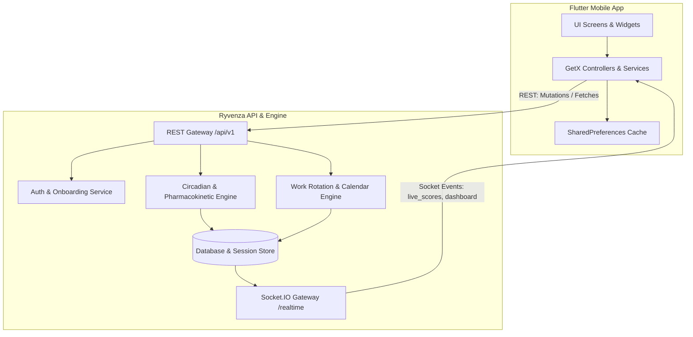
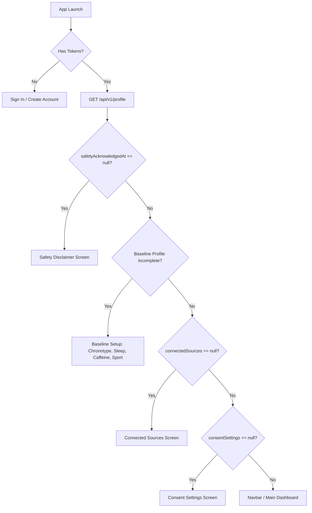
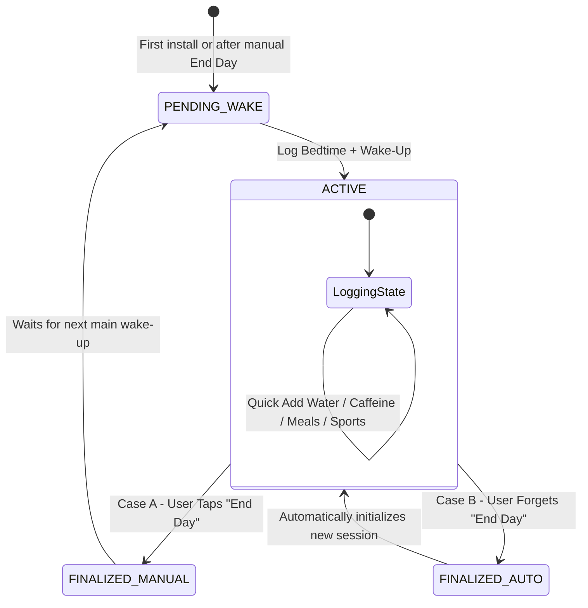

# RYVENZA — Master Backend Architecture & System Specification

> **Confidential & Comprehensive Backend Developer Guide**  
> This document details the entire architecture of the **Ryvenza** platform (`chrisimhof`), including the circadian engine, session lifecycle state machine, mathematical calculation models, real-time WebSocket protocol, multi-step onboarding flow, and full REST API endpoint specifications.

---

## Table of Contents
1. [Platform Vision & Core Concepts](#1-platform-vision--core-concepts)
2. [System Architecture & Communication Flow](#2-system-architecture--communication-flow)
3. [Authentication & Multi-Step Onboarding State Machine](#3-authentication--multi-step-onboarding-state-machine)
4. [Circadian Session Engine & Rollover Architecture](#4-circadian-session-engine--rollover-architecture)
5. [Pillar-by-Pillar Calculations & Mathematical Models](#5-pillar-by-pillar-calculations--mathematical-models)
   - [5.1 Dashboard & Global Rhythm Score](#51-dashboard--global-rhythm-score)
   - [5.2 Sleep Tracking & Rolling Sleep Debt](#52-sleep-tracking--rolling-sleep-debt)
   - [5.3 Caffeine Pharmacokinetics & Cutoff Modeling](#53-caffeine-pharmacokinetics--cutoff-modeling)
   - [5.4 Hydration & Daily Deficit Engine](#54-hydration--daily-deficit-engine)
   - [5.5 Nutrition, Meal Heaviness & Sleep Impact](#55-nutrition-meal-heaviness--sleep-impact)
   - [5.6 Sports Load & Recovery Score Engine](#56-sports-load--recovery-score-engine)
   - [5.7 Work Rotation, Schedule & Calendar Projections](#57-work-rotation-schedule--calendar-projections)
   - [5.8 Analytics & Historical Trends](#58-analytics--historical-trends)
   - [5.9 Contextual "For You" Recommendations](#59-contextual-for-you-recommendations)
6. [Real-Time WebSocket Protocol (Socket.IO)](#6-real-time-websocket-protocol-socketio)
7. [Complete REST API Reference Matrix](#7-complete-rest-api-reference-matrix)
8. [Timestamp, Timezone & Localization (EN / FR) Rules](#8-timestamp-timezone--localization-en--fr-rules)

---

## 1. Platform Vision & Core Concepts

### What is Ryvenza?
**Ryvenza** is a circadian rhythm performance, recovery, and fatigue mitigation platform designed specifically for **shift workers, emergency services, healthcare professionals, industrial teams, and athletes**.

### Fundamental Circadian Concepts:
1. **The Biological Day $\neq$ Calendar Day:**
   - A traditional app resets at `00:00` (midnight). Ryvenza **never resets at midnight**.
   - A shift worker's biological day begins when they wake up (e.g. 15:00 for a night shift worker) and spans across calendar midnight into the next morning.
2. **Dynamic Circadian Adaptation:**
   - Ryvenza adjusts optimal bedtimes, caffeine cutoff windows, meal digestion warnings, and recovery recommendations dynamically based on the active shift (Day, Evening, Night, Off) and user baseline profile (Chronotype, Sleep Target, Caffeine Sensitivity).
3. **Dual Synchronization (REST + WebSocket):**
   - REST endpoints handle user mutations (logging, editing, deleting entries).
   - A WebSocket gateway (`/realtime`) immediately recalculates and broadcasts live circadian scores to all active devices.

---

## 2. System Architecture & Communication Flow



### Server Configuration
* **Base Production URL:** `https://api.ryvenza.app`
* **WebSocket URL:** `https://api.ryvenza.app/realtime` (Transports: `['websocket']`)
* **Auth Scheme:** JWT Bearer Token (`Authorization: Bearer <accessToken>`)

---

## 3. Authentication & Multi-Step Onboarding State Machine

On app launch ([SplashScreenController](file:///Users/saharaislam/Desktop/Tahmid/chrisimhof/lib/features/splash/controller/splash_screen_controller.dart)), the app retrieves the user's profile via `GET /api/v1/profile` and evaluates the onboarding state machine:



### Onboarding Steps & Endpoints:

#### 1. Registration & OTP Verification
* `POST /api/v1/auth/register` $\rightarrow$ Body: `{ "name": "...", "email": "...", "password": "..." }`
* `POST /api/v1/auth/verify` $\rightarrow$ Body: `{ "email": "...", "otp": "123456", "purpose": "register" | "forgot-password" }`
* `POST /api/v1/auth/login` $\rightarrow$ Body: `{ "email": "...", "password": "..." }`
* `POST /api/v1/auth/refresh` $\rightarrow$ Body: `{ "refreshToken": "..." }`

#### 2. Gate 1 — Health & Safety Disclaimer
* `GET /api/v1/onboarding/safety?locale=en|fr`
* `POST /api/v1/onboarding/safety/acknowledge` $\rightarrow$ Sets `safetyAcknowledgedAt = NOW()`.

#### 3. Gate 2 — Baseline Profile Setup
* `PUT /api/v1/profile/baseline`
  ```json
  {
    "sleepTargetMinutes": 480,
    "chronotype": "intermediate",
    "caffeineSensitivity": "medium",
    "sportProfile": "moderate"
  }
  ```
  * **Chronotypes:** `morning_lark`, `intermediate`, `night_owl`
  * **Caffeine Sensitivity:** `low`, `medium`, `high`, `extreme`
  * **Sport Profiles:** `sedentary`, `light`, `moderate`, `heavy`, `athlete`

#### 4. Gate 3 — Connected Sources
* `GET /api/v1/onboarding/sources?locale=en|fr`
* `POST /api/v1/onboarding/sources` $\rightarrow$ Body: `{ "appleHealth": false, "googleHealthConnect": false }`

#### 5. Gate 4 — Consent Settings
* `GET /api/v1/onboarding/consent?locale=en|fr`
* `POST /api/v1/onboarding/consent` $\rightarrow$ Body: `{ "essentialAnalytics": true, "featureNotifications": true, "dataSharingResearch": false }`

---

## 4. Circadian Session Engine & Rollover Architecture

A **Session** (`sessionId`) represents a single biological day cycle.

### Session Status Lifecycle:
| Status | Meaning | Client Behavior |
| :--- | :--- | :--- |
| `PENDING_WAKE` | No main wake has initialized the biological day | Shows Bedtime/Wake-up entry card; Quick Add disabled |
| `ACTIVE` | Current circadian day is actively running | Shows live dashboard scores, enables Quick Add & End Day |
| `FINALIZED` | The day has concluded; summary is immutable | Read-only state; logs saved into historical analytics |



### The Two Session Rollover Flows:

#### Case A: Manual "End Day"
1. User taps **"End my day"** on the dashboard.
2. Client calls `POST /api/v1/calculator/session/:sessionId/end`.
3. Backend finalizes calculations, saves summary with `closedBy: "MANUAL"`, sets session to `FINALIZED`, and returns:
   ```json
   {
     "success": true,
     "message": "Day finalized.",
     "data": {
       "calculation": { /* Final scores */ },
       "newSession": { "sessionId": "new_session_123", "status": "ACTIVE" }
     }
   }
   ```

#### Case B: Automatic Rollover (User Forgot to End Day)
1. If the user went to sleep and forgot to tap "End Day", the session remains open in the backend.
2. The next morning, when the user opens the Sleep Screen and logs their main sleep, the client sends `isNewMainWake: true` to `POST /api/v1/calculator/session/:sessionId/sleep`:
   ```json
   {
     "sleepStartedAt": "2026-09-01T23:00:00.000Z",
     "wakeRecordedAt": "2026-09-02T07:00:00.000Z",
     "isNewMainWake": true,
     "note": "Optional note"
   }
   ```
3. **Backend Logic:**
   - Atomically finalizes the previous open session with `closedBy: "NEW_WAKE"`.
   - Computes and archives final scores.
   - Instantly initializes a new session starting at `wakeRecordedAt`.
   - Applies the active shift schedule for the new day.
   - Returns the new `sessionId`, status `ACTIVE`, and new `liveScores`.
4. Client replaces stored `sessionId` and joins the new WebSocket room.

---

## 5. Pillar-by-Pillar Calculations & Mathematical Models

---

### 5.1 Dashboard & Global Rhythm Score

#### Mathematical Model
The **Global Rhythm Score ($S_{global} \in [0, 100]$)** aggregates score components weighted by circadian importance:
$$S_{global} = w_{sleep}S_{sleep} + w_{caffeine}S_{caffeine} + w_{work}S_{work} + w_{hydration}S_{hydration} + w_{nutrition}S_{nutrition} + w_{sport}S_{sport}$$

#### Sleep Prep Window:
* Automatically activates **2 hours prior to `optimalBedtime`** and remains active until 06:00 AM.
* If `optimalBedtime.sleepAsap == true`, `isSleepPrep` is immediately set to `true`.

#### Unified Live Score Payload (`live_scores` WebSocket & `GET /scores` REST):
```json
{
  "success": true,
  "data": {
    "sessionId": "sess_abc123",
    "globalRhythmScore": 76,
    "optimalBedtime": {
      "time": "22:30",
      "hoursUntilBed": 5.2,
      "sleepAsap": false
    },
    "cards": {
      "sleep": { "score": 85, "subtitle": "7h 30m", "sleepDebtMin": 30, "weeklyTrend": [7.0, 7.5, 6.5, 8.0, 7.0, 7.5, 7.5] },
      "caffeine": { "score": 72, "activeMg": 45.2, "subtitle": "45mg", "cutoffTime": "16:30" },
      "hydration": { "score": 88, "subtitle": "2.4L" },
      "nutrition": { "score": 80, "subtitle": "3/3" },
      "sport": { "score": 85, "recoveryScore": 80, "recoveryLoadScore": 78, "readinessNote": "Optimal readiness for training" },
      "workFit": { "score": 90, "subtitle": "Day shift" }
    },
    "quickAddSummary": {
      "water": { "totalMl": 2400, "displayL": "2.4L" },
      "caffeine": { "totalMg": 160, "displayMg": "160mg" },
      "meals": { "count": 3, "dailyTarget": 3, "display": "3/3" },
      "sport": { "totalMinutes": 45, "display": "45m" }
    },
    "workInfo": {
      "shiftType": "day",
      "shiftStart": "06:00",
      "shiftEnd": "14:00"
    },
    "tabs": {
      "sleep": { /* Sleep tab data */ },
      "caffeine": { /* Caffeine tab data */ },
      "hydration": { /* Hydration tab data */ },
      "nutrition": { /* Nutrition tab data */ },
      "sport": { /* Sport tab data */ },
      "work": { /* Work tab data */ }
    },
    "forYouPreview": [ /* Recommendations array */ ]
  }
}
```

---

### 5.2 Sleep Tracking & Rolling Sleep Debt

#### Business Logic & Mathematical Model
* **Sleep Duration:** $\Delta t = \text{wakeRecordedAt} - \text{sleepStartedAt}$.
* **Daily Sleep Debt ($D_i$):** $D_i = \max(0, \text{sleepTargetMinutes} - \Delta t_i)$.
* **Rolling 7-Day Sleep Debt ($D_{7d}$):**
  $$D_{7d} = \sum_{i=1}^{7} D_i$$
* **Overlap Conflict Prevention:** If a sleep log overlaps with an existing record, the server returns `{ "saved": false, "message": "Sleep overlap conflict detected." }`.

#### Endpoint:
* `POST /api/v1/calculator/session/:sessionId/sleep`

#### Request Schema:
```json
{
  "sleepStartedAt": "2026-09-01T22:30:00.000Z",
  "wakeRecordedAt": "2026-09-02T06:30:00.000Z",
  "isNewMainWake": false,
  "note": "Sleep quality was high"
}
```

#### Response Structure inside `tabs.sleep`:
```json
{
  "sleepStartTime": "22:30",
  "wakeTime": "06:30",
  "tonightBedtime": { "time": "22:30", "targetHours": 8.0 },
  "tonightNote": "Aim for bed by 22:30 — circadian window opens then.",
  "sleepDebt7d": {
    "label": "rolling 7 days",
    "display": "45m",
    "minutes": 45,
    "chartData": [
      { "day": "M", "debtMin": 30, "isToday": false },
      { "day": "T", "debtMin": 45, "isToday": true }
    ]
  },
  "history": [
    { "id": "log_1", "date": "2026-09-01", "sleepStartTime": "22:30", "wakeTime": "06:30", "quality": 85 }
  ]
}
```

---

### 5.3 Caffeine Pharmacokinetics & Cutoff Modeling

#### Pharmacokinetic Half-Life Model
Caffeine clearance follows first-order elimination kinetics with an average biological half-life $t_{1/2} = 5.0\text{ hours}$.
For $N$ drinks consumed at timestamps $t_i$ with dose $A_i$ (mg):
$$\text{Active Caffeine at current time } t = \sum_{i=1}^{N} A_i \times \left(\frac{1}{2}\right)^{\frac{t - t_i}{5.0}}$$

#### Caffeine Cutoff Algorithm:
Calculated such that residual active caffeine at `optimalBedtime` is $\le 25\text{ mg}$ (adjusted by `caffeineSensitivity` multiplier: Low = $4.0\text{h}$, Medium = $5.0\text{h}$, High = $6.5\text{h}$, Extreme = $8.0\text{h}$).

#### Endpoints:
* **Quick Log:** `PATCH /api/v1/calculator/session/:sessionId/log`
  ```json
  { "newCaffeineLogs": [{ "timestamp": "13:30", "caffeineMg": 100, "drinkType": "espresso" }] }
  ```
* **Edit Log:** `PATCH /api/v1/calculator/sessions/:sessionId/caffeine/:entryId`
  ```json
  { "occurredAt": "2026-09-01T13:30:00.000Z", "caffeineMg": 120, "drinkType": "coffee" }
  ```
* **Delete Log:** `DELETE /api/v1/calculator/sessions/:sessionId/caffeine/:entryId`

---

### 5.4 Hydration & Daily Deficit Engine

#### Mathematical Model
* **Daily Goal:** Default $2.5\text{ L}$ ($2500\text{ ml}$), modified by sport session load ($+500\text{ ml}$ per $45\text{m}$ of cardio).
* **Deficit:** $\text{Deficit} = \max(0, \text{dailyGoalMl} - \text{totalDrankTodayMl})$.

#### Endpoints:
* **Quick Log:** `PATCH /api/v1/calculator/session/:sessionId/log`
  ```json
  { "newWaterLogs": [{ "timestamp": "11:00", "volumeMl": 330 }] }
  ```
* **Edit Log:** `PATCH /api/v1/calculator/sessions/:sessionId/hydration/:entryId`
  ```json
  { "occurredAt": "2026-09-01T11:00:00.000Z", "volumeMl": 500 }
  ```
* **Delete Log:** `DELETE /api/v1/calculator/sessions/:sessionId/hydration/:entryId`

---

### 5.5 Nutrition, Meal Heaviness & Sleep Impact

#### Business Logic
* Focuses on **heaviness** (`light`, `medium`, `heavy`) rather than calorie counting, as heavy meals close to bedtime disrupt core body temperature drop and suppress nocturnal melatonin release.
* **Sleep Impact Warning Rule:**
  - `Heavy` meal within $3\text{ hours}$ of bedtime $\rightarrow$ **High Severity Warning**.
  - `Medium` meal within $2\text{ hours}$ of bedtime $\rightarrow$ **Moderate Warning**.
  - `Light` meal within $1\text{ hour}$ of bedtime $\rightarrow$ **Low / Neutral Impact**.

#### Endpoints:
* **Quick Log:** `PATCH /api/v1/calculator/session/:sessionId/log`
  ```json
  {
    "dailyMealTarget": 3,
    "newMealLogs": [
      { "order": 1, "timestamp": "12:30", "plannedTime": "12:30", "heaviness": "medium" }
    ]
  }
  ```
* **Edit Log:** `PATCH /api/v1/calculator/sessions/:sessionId/meals/:entryId`
  ```json
  { "occurredAt": "2026-09-01T12:30:00.000Z", "heaviness": "heavy" }
  ```
* **Delete Log:** `DELETE /api/v1/calculator/sessions/:sessionId/meals/:entryId`
* **Daily Notes:** `GET` / `POST /api/v1/calculator/session/:sessionId/notes` $\rightarrow$ `{ "text": "Ate late due to emergency shift" }`

---

### 5.6 Sports Load & Recovery Score Engine

#### Heart Rate Zone Model & BPM Midpoints
* **Z1 (Active Recovery):** $95\text{--}114\text{ bpm}$ (Avg: $104$) $\rightarrow$ Recovery Impact: $-4$
* **Z2 (Aerobic Base):** $114\text{--}133\text{ bpm}$ (Avg: $123$) $\rightarrow$ Recovery Impact: $-8$
* **Z3 (Tempo / Cardio):** $133\text{--}152\text{ bpm}$ (Avg: $142$) $\rightarrow$ Recovery Impact: $-12$
* **Z4 (Threshold):** $152\text{--}171\text{ bpm}$ (Avg: $161$) $\rightarrow$ Recovery Impact: $-18$
* **Z5 (Anaerobic / Max):** $171\text{--}190\text{ bpm}$ (Avg: $180$) $\rightarrow$ Recovery Impact: $-25$
* **Rest Day:** Recovery Score bonus $+15$ (Clamped to $100$).

#### Endpoints:
* **Quick Log:** `PATCH /api/v1/calculator/session/:sessionId/log`
  ```json
  {
    "newSportSessions": [
      {
        "localDate": "2026-09-01",
        "timestampStart": "17:00",
        "durationMinutes": 45,
        "intensity": "medium",
        "sportType": "cardio",
        "distanceKm": 5.0,
        "heartRateAvgBpm": 142
      }
    ]
  }
  ```
* **Edit Log:** `PATCH /api/v1/calculator/sessions/:sessionId/workouts/:entryId`
* **Delete Log:** `DELETE /api/v1/calculator/sessions/:sessionId/workouts/:entryId`

---

### 5.7 Work Rotation, Schedule & Calendar Projections

#### Multi-Week Shift Rotation Structure
* Users can define cyclical patterns ranging from **1 to 8 weeks** (e.g. 2 Days, 2 Evenings, 2 Nights, 4 Off).
* Shift keys are normalized into lowercase snake_case: `'day'`, `'evening'`, `'night'`, `'off'`, or custom shift names (`'custom_morning'`).

#### Endpoints:
* **Get Presets:** `GET /api/v1/calculator/work-rotation/presets`
* **Get User Rotation:** `GET /api/v1/calculator/work-rotation`
* **Save Rotation (PUT):** `PUT /api/v1/calculator/work-rotation`
  ```json
  {
    "cycleWeeks": 2,
    "startDate": "2026-09-01",
    "sourceTemplateKey": "2_day_2_night_4_off",
    "shiftTimesJson": {
      "day": { "startTime": "06:00", "endTime": "14:00" },
      "evening": { "startTime": "14:00", "endTime": "22:00" },
      "night": { "startTime": "22:00", "endTime": "06:00" }
    },
    "patternJson": [
      { "weekIndex": 0, "dayIndex": 0, "shiftCode": "day" },
      { "weekIndex": 0, "dayIndex": 1, "shiftCode": "day" },
      { "weekIndex": 0, "dayIndex": 2, "shiftCode": "night" },
      { "weekIndex": 0, "dayIndex": 3, "shiftCode": "off" }
    ]
  }
  ```
* **Calendar Projections:** `GET /api/v1/calculator/work-rotation/calendar?from=2026-09-01&days=14`
* **Day Override (POST):** `POST /api/v1/calculator/work-rotation/overrides`
  ```json
  { "date": "2026-09-05", "shiftType": "night", "shiftStartTime": "22:00", "shiftEndTime": "06:00" }
  ```
* **Delete Day Override:** `DELETE /api/v1/calculator/work-rotation/overrides/:date`
* **Delete Rotation:** `DELETE /api/v1/calculator/work-rotation`

---

### 5.8 Analytics & Historical Trends

#### Endpoint:
* `GET /api/v1/analytics?period=7d|30d|90d|365d`

#### Response Schema:
```json
{
  "success": true,
  "data": {
    "globalRhythmScore": { "average": 78 },
    "avgScores": {
      "sleepScore": 82,
      "caffeineScore": 75,
      "sportScore": 80,
      "hydrationScore": 85,
      "nutritionScore": 70,
      "workFitScore": 88
    },
    "circadianStability": { "latest": 84, "label": "+6 vs last week" },
    "sleepDuration": {
      "avgDisplay": "7h 15m",
      "trend": [ { "date": "2026-08-25", "durationMinutes": 435 } ]
    },
    "recovery": { "latest": 80, "diff": 4 },
    "scoreTrend": [ { "recoveryScore": 80 } ],
    "sleepDebt7d": { "display": "1h 15m", "diffDisplay": "-20m", "minutes": 75 },
    "fatiguePrediction": { "expectedAt": "14:30" },
    "weeklyBlocksfatigue": [ { "score": 65 } ]
  }
}
```

---

### 5.9 Contextual "For You" Recommendations

#### Endpoint:
* `GET /api/v1/calculator/session/:sessionId/recommendations?locale=en|fr`

#### Response Schema:
```json
{
  "success": true,
  "data": [
    {
      "category": "sleep",
      "priority": 1,
      "title": "Sleep Window",
      "body": "Aim for bed by 22:30 — your circadian window opens then.",
      "bodyParams": { "bedtime": "22:30" }
    },
    {
      "category": "caffeine",
      "priority": 2,
      "title": "Caffeine Cutoff",
      "body": "Last coffee before 16:30. You currently have 65mg active.",
      "bodyParams": { "cutoffTime": "16:30" }
    },
    {
      "category": "hydration",
      "priority": 3,
      "title": "Hydration Goal",
      "body": "800ml left today — drink 200ml per hour before 21:00.",
      "bodyParams": { "goalL": 2.5, "deficitMl": 800 }
    }
  ]
}
```

---

## 6. Real-Time WebSocket Protocol (Socket.IO)

* **Gateway:** `https://api.ryvenza.app/realtime`
* **Transport:** `['websocket']`
* **Connection Handshake:**
  ```javascript
  const socket = io('https://api.ryvenza.app/realtime', {
    transports: ['websocket'],
    auth: { token: accessToken }
  });
  ```

### Client Emits:
* `socket.emit('join_session', { sessionId: 'sess_123' })`
* `socket.emit('leave_session', { sessionId: 'sess_123' })`

### Server Broadcasts:
* `live_scores`: Triggered after any log addition, edit, delete, or rollover. Broadcasts the full updated scores and tab records to all clients in the session room.
* `dashboard`: Broadcasts top-level summary updates.
* `session_ended`: Broadcasts when a session is finalized manually or automatically.

---

## 7. Complete REST API Reference Matrix

| Category | Method | Endpoint Path | Primary Purpose |
| :--- | :--- | :--- | :--- |
| **Auth** | `POST` | `/api/v1/auth/register` | Register new user account |
| **Auth** | `POST` | `/api/v1/auth/verify` | Verify OTP code |
| **Auth** | `POST` | `/api/v1/auth/login` | Sign in with email & password |
| **Auth** | `POST` | `/api/v1/auth/refresh` | Exchange refresh token for new access token |
| **Auth** | `POST` | `/api/v1/auth/google` | Verify Google OAuth token |
| **Auth** | `POST` | `/api/v1/auth/microsoft` | Verify Microsoft OAuth token |
| **Auth** | `POST` | `/api/v1/auth/forgot-password` | Request password reset code |
| **Auth** | `POST` | `/api/v1/auth/reset-password` | Reset password using OTP code |
| **Profile** | `GET` | `/api/v1/profile` | Retrieve profile and onboarding gates |
| **Profile** | `PUT` | `/api/v1/profile` | Update user name, bio, and avatar |
| **Profile** | `PUT` | `/api/v1/profile/password` | Change user password |
| **Profile** | `PUT` | `/api/v1/profile/baseline` | Save baseline chronotype & sleep targets |
| **Session** | `GET` | `/api/v1/calculator/session` | Fetch or initialize active session |
| **Session** | `POST` | `/api/v1/calculator/session/:id/end` | Manual "End Day" finalization |
| **Session** | `POST` | `/api/v1/calculator/session/:id/reset` | Reset current session logs |
| **Session** | `GET` | `/api/v1/calculator/session/:id/scores` | Fetch live circadian scores |
| **Session** | `POST` | `/api/v1/calculator/session/:id/calculate` | Trigger on-demand score calculation |
| **Logs** | `PATCH` | `/api/v1/calculator/session/:id/log` | Quick-add water, caffeine, meals, workouts |
| **Sleep** | `POST` | `/api/v1/calculator/session/:id/sleep` | Log sleep / Auto-rollover on new wake |
| **Caffeine** | `PATCH` | `/api/v1/calculator/sessions/:id/caffeine/:entryId` | Edit caffeine log entry |
| **Caffeine** | `DELETE` | `/api/v1/calculator/sessions/:id/caffeine/:entryId` | Delete caffeine log entry |
| **Hydration** | `PATCH` | `/api/v1/calculator/sessions/:id/hydration/:entryId` | Edit water log entry |
| **Hydration** | `DELETE` | `/api/v1/calculator/sessions/:id/hydration/:entryId` | Delete water log entry |
| **Meals** | `PATCH` | `/api/v1/calculator/sessions/:id/meals/:entryId` | Edit meal log entry |
| **Meals** | `DELETE` | `/api/v1/calculator/sessions/:id/meals/:entryId` | Delete meal log entry |
| **Notes** | `POST` | `/api/v1/calculator/session/:id/notes` | Add daily nutrition note |
| **Notes** | `GET` | `/api/v1/calculator/session/:id/notes` | Fetch daily notes list |
| **Workouts** | `PATCH` | `/api/v1/calculator/sessions/:id/workouts/:entryId` | Edit workout session entry |
| **Workouts** | `DELETE` | `/api/v1/calculator/sessions/:id/workouts/:entryId` | Delete workout session entry |
| **Work Settings** | `PATCH` | `/api/v1/calculator/work-settings` | Sync device timezone (`Europe/Zurich`), default rotation & shift reminders |
| **Rotation** | `GET` | `/api/v1/calculator/work-rotation/presets` | Fetch shift rotation templates |
| **Rotation** | `GET` | `/api/v1/calculator/work-rotation` | Fetch active user rotation |
| **Rotation** | `PUT` | `/api/v1/calculator/work-rotation` | Save multi-week rotation pattern |
| **Rotation** | `DELETE` | `/api/v1/calculator/work-rotation` | Delete custom rotation |
| **Rotation** | `GET` | `/api/v1/calculator/work-rotation/calendar` | Projected shift calendar by date range |
| **Rotation** | `POST` | `/api/v1/calculator/work-rotation/overrides` | Apply single-day shift override |
| **Rotation** | `DELETE` | `/api/v1/calculator/work-rotation/overrides/:date` | Remove single-day shift override |
| **Analytics**| `GET` | `/api/v1/analytics?period={period}` | Aggregated historical metrics (7d/30d/90d/365d) |
| **Advice** | `GET` | `/api/v1/calculator/session/:id/recommendations` | Contextual "For You" recommendations |
| **Account** | `DELETE` | `/api/v1/users/:userId/permanent` | Permanent GDPR/CCPA account deletion |

---

## 8. Timestamp, Timezone & Localization (EN / FR) Rules

### 1. Device Timezone Synchronization & Usage (`PATCH /api/v1/calculator/work-settings`)
* **How It Works:** On app launch and session startup, the mobile app automatically detects the device's IANA timezone identifier (e.g. `Europe/Zurich`, `America/New_York`, `Asia/Tokyo`) using the `flutter_timezone` plugin and synchronizes it silently with the backend:
  ```http
  PATCH /api/v1/calculator/work-settings
  Content-Type: application/json
  Authorization: Bearer <token>
  ```
  ```json
  {
    "defaultRotation": "3-2-2 night",
    "shiftReminderEnabled": true,
    "shiftReminderMinutes": 30,
    "timezone": "Europe/Zurich"
  }
  ```
* **How the Backend Uses the Device Timezone:**
  - **Local Calendar Projections:** Aligns rotation cycle weeks to the user’s local calendar dates (`Monday` $\rightarrow$ `Sunday`), ensuring that day boundaries match the user's geographic location.
  - **Shift Reminders & Notifications:** Computes pre-shift reminder triggers (e.g., $30\text{ minutes}$ before shift start) adjusted for the user's active timezone.
  - **Circadian Window & Countdown Forecasting:** Accurately calculates optimal bedtime countdowns (`hoursUntilBed`) and sleep preparation windows relative to the user's local civil clock, automatically accounting for Daylight Saving Time (DST) changes.
  - **Timezone Display Formatting:** Returns localized display strings (e.g., `timezoneDisplay: "CET (UTC+1)"` or `"Europe/Zurich"`) so the mobile app can display timezone info in the Work Schedule settings screen.

### 2. Absolute UTC Timestamps for Event Logging
* All mutation endpoints (`occurredAt`, `sleepStartedAt`, `wakeRecordedAt`) must receive and persist standard **ISO-8601 UTC strings** (e.g., `2026-09-01T22:30:00.000Z`).
* Duration and decay calculations must use absolute epoch millisecond differences rather than local clock hour subtractions.

### 3. Localization (`locale=en|fr`)
* The backend must accept the `locale` query parameter on all recommendation, safety, consent, and score endpoints.
* Text fields like `drinkLabel`, `subtitle`, `sleepImpactNote`, `readinessNote`, and `forYouPreview.body` must be dynamically localized based on the requested locale.

### 4. No Automatic Midnight Reset
* Under no circumstances should backend cron jobs close or reset active sessions at `00:00:00`. Sessions only conclude via explicit user **"End Day"** or **`isNewMainWake: true` Rollover**.

